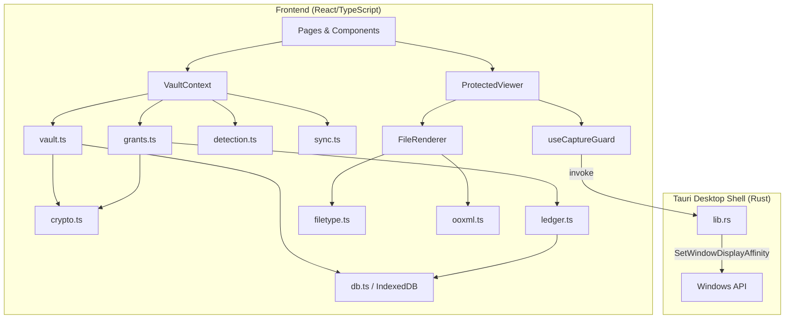

# Canopy: Technical Writeup

## 1. Technical Overview

Canopy is a zero-trust, offline-first cryptographic vault and protected document viewer built as a native Windows desktop application. It addresses a specific problem in research environments: the uncontrolled distribution and viewing of sensitive pre-publication materials such as manuscripts, datasets, images, and code.

The system encrypts files at rest using AES-256-GCM with a hierarchical key architecture rooted in a passphrase-derived master key. It shares access through capability-based links where revocation is cryptographic (the wrapped key is destroyed, not flagged). It renders protected content through an isolated, script-free viewer that applies OS-level screenshot blocking via the Windows `SetWindowDisplayAffinity` API. Every interaction is recorded in a tamper-evident, hash-chained audit ledger that feeds nine deterministic leak-detection heuristics.

The application runs as a Tauri v2 hybrid: a React/TypeScript frontend handles the vault logic, cryptography, file rendering, and UI, while a minimal Rust backend provides the native window handle needed for capture protection. All data is persisted locally in IndexedDB with no external server dependency.

## 2. Architecture



**VaultContext** is the central state provider. It holds the master key in memory (never persisted), manages the vault lifecycle (`booting > locked > unlocked`), orchestrates all CRUD operations through pure library functions, and exposes them to the UI through a single React context.

**IndexedDB** is the system of record. Ten object stores (`meta`, `assets`, `chunks`, `grants`, `people`, `events`, `transfers`, `devices`, `outbox`, `acks`) hold all vault data locally. All writes go through either unconditional `put` or compare-and-swap `casPut` (guarded by a `rev` field) to prevent concurrent tabs from silently overwriting each other.

**Tauri (Rust)** exposes exactly two IPC commands: `enable_capture_protection` and `disable_capture_protection`. These call `SetWindowDisplayAffinity` with `WDA_EXCLUDEFROMCAPTURE` on the application's `HWND`, preventing the OS compositor from including the window in screenshots, screen recordings, and remote desktop streams.

## 3. Core Technical Implementation

### Cryptographic Key Hierarchy

The key architecture uses four layers, all implemented with the Web Crypto API:

1. **Passphrase to Master Key.** PBKDF2 with SHA-256 and 250,000 iterations derives an AES-GCM-256 master key from a user passphrase (NFKC-normalised) and a 16-byte random salt. Correctness is verified by decrypting a known-plaintext verifier blob.

2. **Master Key wraps Content Keys.** Each ingested asset receives its own AES-GCM-256 content key, generated via `generateKey`. This key is exported to raw bytes, then AES-GCM-encrypted (wrapped) under the master key and stored alongside the asset record.

3. **Content Key encrypts chunks.** Files are split into 1 MiB chunks. Each chunk is encrypted with AES-GCM using its content key and a unique 96-bit IV. A SHA-256 digest is computed over each ciphertext chunk, and a Merkle-style root hash is derived from the concatenation of all chunk digests, providing file-level integrity verification.

4. **Grant Key re-wraps Content Key.** When a share link is issued, a 256-bit random capability token is generated. HKDF-SHA-256 (with a `canopy/grant/v1` info string and a per-grant 16-byte salt) derives a grant key from the token. The content key is re-wrapped under this grant key. Revocation deletes the wrapped key from the grant record, making the token cryptographically useless; this is not a flag the client can ignore.

Passphrase rotation re-wraps every content key under the new master key in a single atomic transaction.

### Sealed Container Format (`.canopy`)

The proprietary binary format carries ciphertext offline:

```
"CANOPY01" | uint32 header length (big-endian) | JSON header | ciphertext chunks...
```

The JSON header contains asset metadata, per-chunk IVs and digests, the content key wrapped under the grant key (with salt), watermark seed, terms hash, and provenance information. `verifyContainer` recomputes every chunk digest and the root hash, making tampering detectable before any decryption is attempted.

### Protected Viewer and Capture Guard

The `ProtectedViewer` component is the sole rendering surface for sealed content. Decrypted plaintext exists only as in-memory blob URLs, never written to disk by the application. The `useCaptureGuard` hook provides layered deterrence:

- **OS-level:** Invokes the Rust backend to set `WDA_EXCLUDEFROMCAPTURE` on the window handle, removing it from the compositor's capture surface.
- **Focus-based:** Blanks content with a backdrop-blur overlay whenever the window loses focus or visibility, preventing background-window screenshots.
- **Input interception:** Traps PrintScreen, Ctrl+P, copy/cut, drag, and context menu events. Each attempt is counted, logged to the ledger, and the clipboard is overwritten with a notice.

The system explicitly states in both code comments and UI copy that it cannot prevent hardware capture (phone cameras, HDMI capture cards).

### File Type Detection and Rendering

`filetype.ts` implements content-sniffing based on magic-byte signatures (a 64-byte header read), covering PDF, PNG, JPEG, GIF, BMP, TIFF, FLAC, MP3, MP4, WebM, OGG, RIFF/WAV/AVI/WEBP, OOXML (via PK zip header), and legacy OLE. The declared MIME type is treated as a hint; when it contradicts the bytes, the mismatch is surfaced to the user. Executables (MZ, ELF, Mach-O) are identified and refused.

The renderer registry dispatches to format-specific components: images, PDFs, audio, and video stream from blob URLs; Markdown is parsed to sanitised HTML; JSON is pretty-printed with collapsible nodes; CSV/TSV are parsed into bounded tables; DOCX, XLSX, and PPTX are opened as zip archives via JSZip, with only text and structure extracted (no macros, no external relationships, no formula evaluation, no DDE fields). All rendering is bounded by `PREVIEW_LIMITS` (32 MB decode ceiling, 400K text characters, 2000 table rows, 250:1 compression ratio limit for zip-bomb detection).

## 4. Data Flow: Ingestion to Controlled Release

**Ingest.** Files enter through `useTransferQueue`, a single-lane, resumable queue. Each file is validated against size limits (256 MB max, 1 byte min), then processed by `sealFile`: it generates a content key, wraps it under the master key, encrypts file data chunk-by-chunk (1 MiB), computes per-chunk SHA-256 digests, and derives a Merkle root. Progress is persisted to IndexedDB after every chunk; a crash or closed window loses at most one chunk in flight. Duplicate detection compares root hashes and deduplicates automatically.

**Controlled access.** `createGrant` produces a capability token, derives a grant key via HKDF, re-wraps the content key, and constructs a link. The token is shown to the owner once and never stored. `openWithToken` reverses the process: it hashes the token to find the grant, checks policy (expiry, open count, device binding, terms acceptance, revocation status), derives the grant key, and unwraps the content key. Every outcome (success, denial, terms acceptance/decline) is written to the ledger.

**Release modes.** "Protected" grants allow in-viewer reading only. "Released" grants permit exporting either a sealed `.canopy` container (ciphertext with re-wrapped key) or a plain copy with provenance: text files receive an appended footer (lab name, digest, grant ID, terms hash); images are watermarked via Canvas 2D with a tiled diagonal overlay carrying the recipient's identity, grant fingerprint, and timestamp.

## 5. Engineering, Reliability, and Security

### Tamper-Evident Ledger

The audit ledger (`ledger.ts`) is an append-only, hash-chained log. Each entry contains a sequence number, timestamp, event type (25 defined types), actor/device IDs, optional asset/grant references, and a detail payload. The entry's `prevHash` commits to the SHA-256 hash of the preceding entry (genesis hash is 64 zero characters). `verifyChain` recomputes every hash from scratch, detecting insertions, deletions, or modifications. Sequence allocation is serialised using the Web Locks API (with an in-process mutex fallback) to prevent two concurrent windows from minting the same sequence number.

### Leak-Detection Engine

`detection.ts` implements nine deterministic heuristic rules that run over the ledger and current vault state: bulk egress bursts (sliding window, 5+ items in 30 minutes), departure-surge correlation (access climbing within 45 days of a departure date), outside-domain releases, unrecognised device access, retry-after-revocation patterns, off-hours access (midnight to 05:00), capture pressure (accumulated screenshot/print attempts), ciphertext integrity failures, and dormant access (unused grants older than 30 days). Each signal carries an evidence list of ledger sequence numbers, a severity rating, and a recommended one-click action (revoke grants, offboard person, or review). Each rule's known blind spots are documented in-code and in the UI.

### Concurrency and Resilience

All record mutations use compare-and-swap writes with a `rev` field to prevent stale-tab overwrites. The transfer queue is designed for crash recovery: interrupted transfers are detected on mount by scanning for `running` or `paused` transfer records, and can be resumed by re-attaching the original file (validated by size match). The auto-lock timer polls every 15 seconds and locks the vault after a configurable idle period, clearing the master key from memory and revoking all blob URLs.

### Sync Model

Local peer replication operates over a `BroadcastChannel` (`canopy.sync.v1`). Mutations, lock state, and presence are broadcast between windows on the same machine. An outbox with exponential backoff (0s to 10m) queues operations when no peer is reachable. The codebase explicitly states that remote relay (machine-to-machine sync) is not shipped in this build.

## 6. Current Implementation and Technical Differentiation

**Implemented and operational:** Vault creation and passphrase-based unlock with PBKDF2 key derivation; chunked AES-GCM encryption and decryption with Merkle integrity verification; the full grant lifecycle (creation, HKDF-based key wrapping, policy evaluation, device binding, terms enforcement, extension, revocation by key destruction); the `.canopy` sealed container format with build, parse, and verify operations; the universal file renderer covering images, PDFs, audio, video, Markdown, JSON, XML, CSV/TSV, DOCX, XLSX, PPTX, 30+ code languages, and archives; OS-level capture protection via Rust/Win32; the hash-chained audit ledger with chain verification; all nine leak-detection heuristics; dynamic watermarking (live overlay and baked-into-image); the resumable single-lane transfer queue; collaborator management with one-click offboarding; passphrase rotation with bulk key re-wrapping; BroadcastChannel-based local sync with a durable outbox; auto-lock; and storage persistence requests.

**Not implemented:** Remote machine-to-machine sync (the outbox is built but no relay endpoint exists). The codebase documents this limitation explicitly rather than simulating it.

The technically differentiating aspect of this implementation is that its security properties are structural rather than decorative. Revocation destroys the wrapped key, making the grant token cryptographically inert. The ledger's hash chain makes post-hoc editing detectable by anyone who runs `verifyChain`. The detection rules point at specific ledger entries as evidence. The capture guard uses a real OS API (`SetWindowDisplayAffinity`), not CSS tricks. And every known limitation (phone cameras, hardware capture, threshold evasion, clearing site data) is stated in the code and in the user interface.
