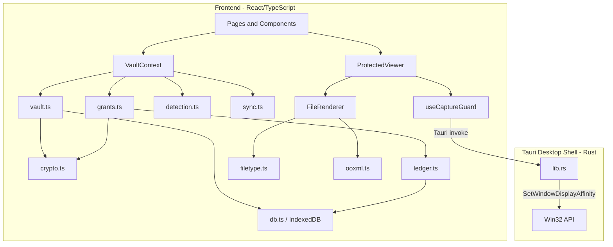

# Canopy: Technical Writeup

**ICSC 2026 Universities Hackathon -- Track F: Protecting University Research**

## 1. Technical Overview

Track F identifies a specific, unsolved problem: university laboratories hold unpublished results, draft patent applications, novel methods, and datasets gathered over years, but the protection around these materials is close to nothing. Files live on shared drives with stale permissions, personal cloud accounts, students' laptops, and WhatsApp groups. Staff and students turn over every year, and nobody revokes old access. The challenge statement notes that encryption alone is insufficient because the real difficulty is people, and any control heavy enough to work will be bypassed by a researcher facing a deadline.

Canopy is a native Windows desktop application (Tauri v2) that addresses this by making research files viewable only inside a cryptographically sealed, capture-protected environment, while preserving normal collaborative workflows through capability-based share links. Files are encrypted at rest with AES-256-GCM under a hierarchical key architecture. Access is shared through links where revocation is cryptographic: the wrapped decryption key is destroyed, not flagged. Content is rendered through an isolated, script-free viewer with OS-level screenshot blocking via the Windows `SetWindowDisplayAffinity` API. Every interaction is recorded in a tamper-evident, hash-chained audit ledger that feeds nine deterministic leak-detection heuristics. The application is fully offline-first with all data persisted locally in IndexedDB, requiring no external server dependency, an important property for campus environments with unreliable connectivity.

## 2. Architecture

**VaultContext** is the central state provider. It holds the master key in memory (never persisted), manages the vault lifecycle (`booting > locked > unlocked`), orchestrates all operations through pure library functions, and exposes them to the UI through a single React context.

**IndexedDB** is the system of record. Ten object stores (`meta`, `assets`, `chunks`, `grants`, `people`, `events`, `transfers`, `devices`, `outbox`, `acks`) hold all vault data locally. Writes go through either unconditional `put` or compare-and-swap `casPut` (guarded by a `rev` field) to prevent concurrent tabs from overwriting each other.

**Tauri (Rust)** exposes exactly two IPC commands: `enable_capture_protection` and `disable_capture_protection`. These call `SetWindowDisplayAffinity` with `WDA_EXCLUDEFROMCAPTURE` on the application's `HWND`, removing the window from the OS compositor's capture surface for screenshots, screen recordings, and remote desktop streams.

## 3. Core Technical Implementation

### Cryptographic Key Hierarchy

The key architecture uses four layers, all implemented with the Web Crypto API:

1. **Passphrase to Master Key.** PBKDF2 with SHA-256 and 250,000 iterations derives an AES-GCM-256 master key from a user passphrase (NFKC-normalised) and a 16-byte random salt. A known-plaintext verifier blob confirms correctness.

2. **Master Key wraps Content Keys.** Each ingested asset receives its own AES-GCM-256 content key. This key is exported to raw bytes, AES-GCM-encrypted (wrapped) under the master key, and stored alongside the asset record.

3. **Content Key encrypts chunks.** Files are split into 1 MiB chunks. Each chunk is encrypted with AES-GCM using a unique 96-bit IV. A SHA-256 digest is computed over each ciphertext chunk, and a Merkle-style root hash is derived from the concatenated chunk digests, providing file-level integrity verification.

4. **Grant Key re-wraps Content Key.** When a share link is issued, a 256-bit random capability token is generated. HKDF-SHA-256 (with a `canopy/grant/v1` info string and a per-grant salt) derives a grant key from the token. The content key is re-wrapped under this grant key. Revocation deletes the wrapped key, making the token cryptographically useless. This is not a flag the client can choose to ignore.

Passphrase rotation re-wraps every content key under the new master key in a single atomic transaction.

### Protected Viewer and Capture Guard

The `ProtectedViewer` component is the sole rendering surface for sealed content. Decrypted plaintext exists only as in-memory blob URLs, never written to disk. The `useCaptureGuard` hook provides layered deterrence:

- **OS-level:** Invokes the Rust backend to set `WDA_EXCLUDEFROMCAPTURE`, removing the window from the compositor's capture surface.
- **Focus-based:** Blanks content with a backdrop-blur overlay whenever the window loses focus or visibility.
- **Input interception:** Traps PrintScreen, Ctrl+P, copy/cut, drag, and context menu events. Each attempt is counted, logged to the audit ledger, and the clipboard is overwritten.

The system explicitly states in the UI that it cannot prevent hardware capture (phone cameras, HDMI cards). This honesty is a deliberate design choice aligned with the challenge guidance to "show where your solution fails."

### File Type Detection and Universal Renderer

`filetype.ts` implements content-sniffing based on magic-byte signatures (64-byte header read), covering PDFs, images (PNG, JPEG, GIF, BMP, TIFF), audio (FLAC, MP3, WAV), video (MP4, WebM, AVI), OOXML documents, and legacy OLE. The declared MIME type is treated as a hint; contradictions are surfaced. Executables are identified and refused.

The renderer dispatches to format-specific components: images, PDFs, audio, and video stream from blob URLs; Markdown is parsed to sanitised HTML; JSON is pretty-printed; CSV/TSV render as bounded tables; DOCX, XLSX, and PPTX are opened via JSZip with only text and structure extracted (no macros, no external relationships, no formula evaluation). All rendering is bounded by hard limits (32 MB decode ceiling, 400K text characters, 2000 table rows, 250:1 compression ratio cap for zip-bomb detection).

## 4. Addressing Track F: Ingestion, Controlled Release, and Leak Detection

**Making files harder to copy or take away.** Files enter through a single-lane, resumable queue (`useTransferQueue`). `sealFile` generates a content key, encrypts chunk-by-chunk, and computes a Merkle root. Progress is persisted after every chunk, so a crash, power cut, or closed window loses at most one chunk. Content is viewable only inside the capture-protected viewer. Even when a file is exported as a sealed `.canopy` container (a binary format: `CANOPY01` magic, JSON header with per-chunk IVs/digests and a re-wrapped key, ciphertext chunks), the container is useless ciphertext without the corresponding link token.

**Controlled sharing with a record of what was shared and with whom.** `createGrant` produces a capability token, derives a grant key via HKDF, and constructs a link. The token is shown once and never stored. `openWithToken` reverses the process: hashes the token to find the grant, evaluates policy (expiry, open count, device binding, terms acceptance, revocation status), derives the grant key, and unwraps the content key. Every outcome is written to the ledger. Released copies carry provenance footers (lab name, digest, grant ID, terms hash) for text, and diagonal identity watermarks burned into images via Canvas 2D. Sharing terms must be accepted before access opens and the acceptance is recorded permanently.

**Detecting realistic leak patterns.** `detection.ts` implements nine heuristic rules: bulk egress bursts (sliding window, 5+ distinct items in 30 minutes), departure-surge correlation (access climbing within 45 days of a recorded departure date), outside-domain releases (grants pointing at non-institutional email addresses), unrecognised device access, retry-after-revocation (repeated attempts on a dead link), off-hours access (midnight to 05:00), capture pressure (accumulated screenshot/print attempts), ciphertext integrity failures, and dormant access (unused grants older than 30 days). Each signal carries specific ledger entries as evidence, a severity rating, and a one-click recommended action (revoke grants, offboard person, or review). Each rule's known blind spots are documented in the code and displayed in the UI.

**Handling staff and student turnover.** The `offboardPerson` function revokes every active grant held by a departing collaborator in a single atomic operation, directly addressing the challenge's observation that "nobody ever takes their access away." Departure dates are tracked per-collaborator and feed the departure-surge detection rule automatically.

## 5. Engineering, Reliability, and Security

### Tamper-Evident Ledger

The audit ledger is an append-only, hash-chained log. Each entry commits to the SHA-256 hash of the preceding entry (genesis hash: 64 zero characters). `verifyChain` recomputes every hash from scratch. Sequence allocation is serialised via the Web Locks API (with an in-process mutex fallback) to handle multiple windows safely.

### Offline Resilience

The challenge states: "In Nigeria these are normal, not rare. Say what happens to your solution when it is offline for a few hours." Canopy's answer: nothing breaks. All data lives in IndexedDB. Transfers are chunked and resumable. Unsent mutations queue in a durable outbox with exponential backoff (0s to 10m). Local peer replication over a `BroadcastChannel` keeps multiple windows consistent. The vault is fully functional with no network at all.

### Concurrency Control

All record mutations use compare-and-swap with a `rev` field. The auto-lock timer clears the master key from memory after a configurable idle period, revoking all blob URLs. Crash recovery detects interrupted transfers on mount and allows resumption by re-attaching the original file (validated by size match).

## 6. Mapping to Track F Deliverables

| Track F Requirement | Implementation |
|---|---|
| **A working prototype that makes files harder to copy, forward or take away** | Files encrypted with AES-256-GCM, viewable only inside a capture-protected viewer with OS-level screenshot blocking, content decrypted in memory only, sealed `.canopy` container format for offline transport. |
| **Detection of realistic leak patterns** | Nine deterministic rules with evidence trails, covering mass download, departure-surge, external sharing, unknown devices, revocation retries, off-hours access, capture attempts, integrity failures, and dormant access. |
| **Controlled sharing with external partners, with a record** | HKDF-derived capability links with configurable expiry, open limits, device binding, mandatory terms acceptance, dynamic watermarking, and provenance footers. Full audit trail in hash-chained ledger. |
| **Offline and power-cut resilience** | Fully offline-first. IndexedDB persistence, chunked resumable transfers, durable outbox with backoff. |

**Honest limitations.** Remote machine-to-machine sync is not shipped (the outbox exists but no relay endpoint is connected). Hardware capture (phone cameras, HDMI) cannot be prevented by any user-space application, and the UI says so. Detection thresholds are fixed and a patient attacker below them is missed. Device identity resets when site data is cleared.
